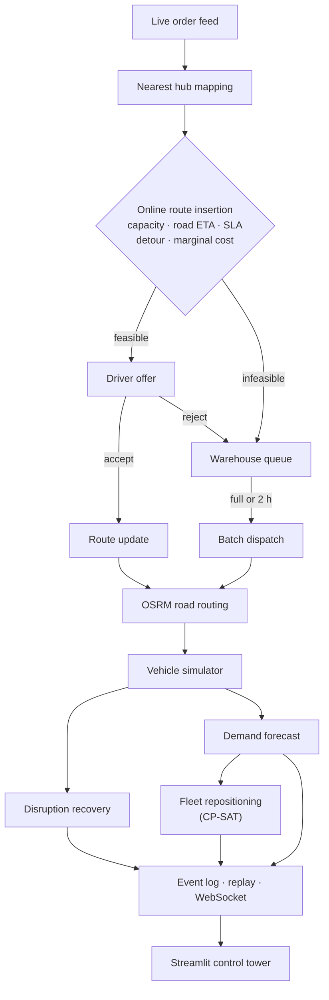
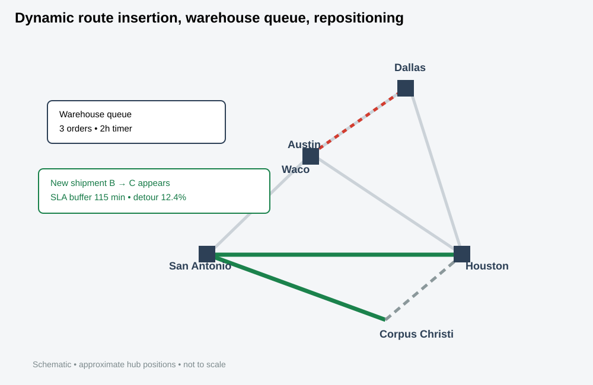
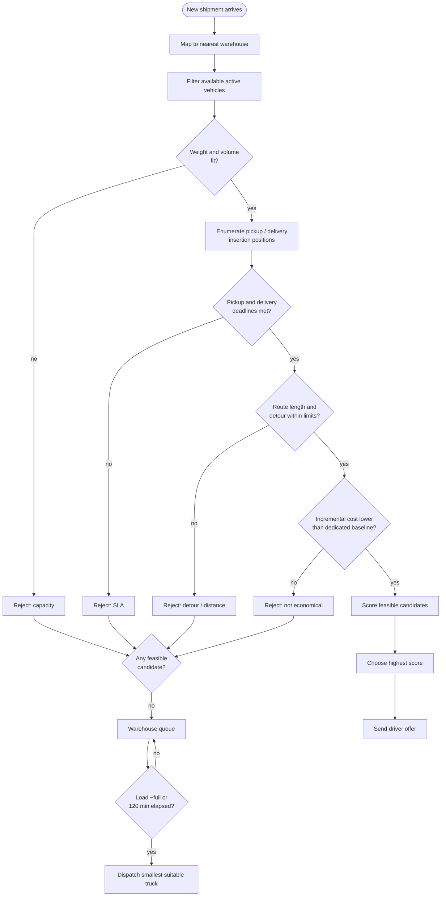
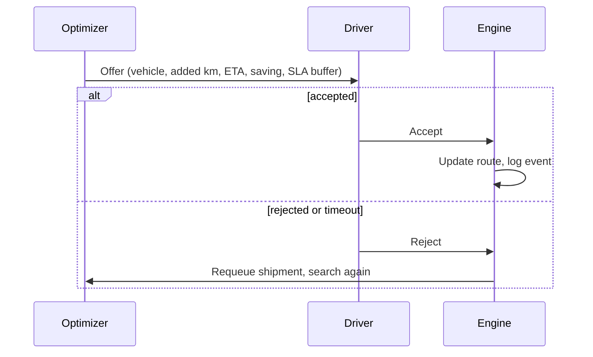
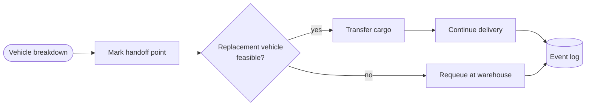
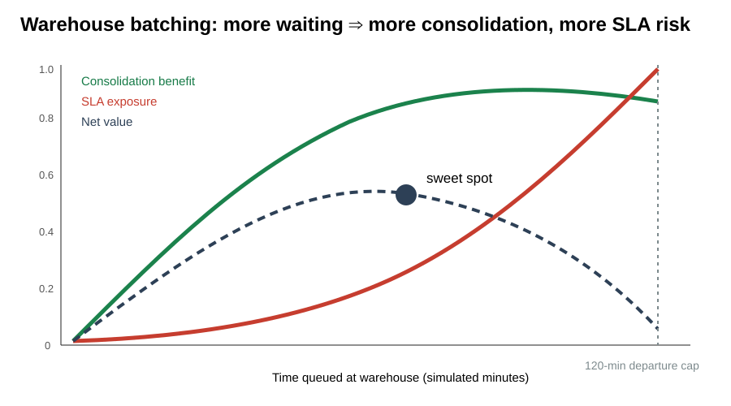
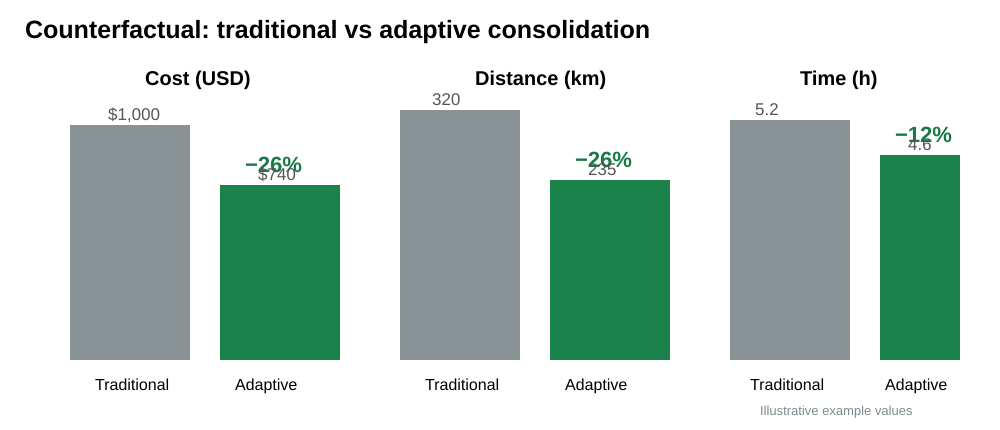
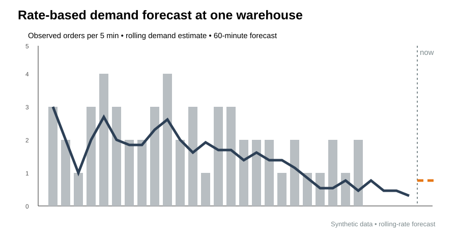

# Adaptive Freight

**Real-time freight consolidation, routing, and fleet repositioning under capacity and time-window constraints.**

Adaptive Freight is an operations-research prototype that treats freight movement as a *dynamic* decision problem instead of a static shortest-path problem. When a new shipment arrives while trucks are already on the road, the system decides whether to:

1. insert it into an active route,
2. queue it at a warehouse for consolidation,
3. hand it to another vehicle (e.g. after a breakdown), or
4. dispatch a new vehicle.

Every decision is feasibility-checked, costed against a counterfactual baseline, and explained.

**Live backend:** https://adaptive-freight.onrender.com

---

## Contents

- [Highlights](#highlights)
- [Core idea](#core-idea)
- [Mathematical model](#mathematical-model)
- [Architecture](#architecture)
- [Visual overview](#visual-overview)
- [Modules](#modules)
- [API](#api)
- [Getting started](#getting-started)
- [Configuration](#configuration)
- [Deployment](#deployment)
- [Testing](#testing)
- [Assumptions and limitations](#assumptions-and-limitations)
- [Roadmap](#roadmap)
- [Author](#author)

---

## Highlights

- **Dynamic route insertion** into vehicles that are already moving, with separate weight and volume checks
- **Road-network ETAs** from OSRM, with real-vs-fallback route tracking
- **Pickup and delivery time windows**, including loading/unloading service time and an SLA buffer
- **Warehouse batching**: queue until the truck is nearly full or 120 simulated minutes elapse
- **Empty-mile and backhaul analysis**
- **Breakdown recovery** via cargo handoff to a replacement vehicle
- **Rate-based demand forecasting** feeding **OR-Tools CP-SAT** idle-fleet repositioning
- **Driver-in-the-loop** accept/reject offers
- **Explainable decisions**: each choice lists why competing candidates were rejected
- **Counterfactual metrics**: cost and time saved versus a dedicated-vehicle baseline
- **Event-driven simulation** with replayable history, a REST/WebSocket API, and a Streamlit control tower

---

## Core idea

Suppose an active truck is traveling **A → C**, and a new shipment appears going **B → C**. A naive system dispatches another truck. Adaptive Freight first tests whether **A → B → C** is feasible:

- enough remaining weight and volume capacity
- route-distance and detour limits respected
- pickup and delivery deadlines met, including service times

and accepts it only if consolidation is cheaper than the baseline:

$$
C_{\text{incremental}} < C_{\text{baseline}}
$$

Two design principles follow from this:

- **Feasible ≠ operationally attractive.** Spare capacity does not justify an arbitrarily large detour.
- **Fast local decisions plus slow global planning.** Per-order insertion runs online; fleet repositioning runs periodically with an exact solver.

---

## Mathematical model

### Notation

| Symbol | Meaning |
|---|---|
| $V, S, W$ | vehicles, shipments, warehouses |
| $o_s, d_s$ | pickup and delivery location of shipment $s$ |
| $w_s, a_s$ | shipment weight, volume |
| $t^p_s, t^d_s$ | pickup and delivery deadlines |
| $\tau^p_s, \tau^d_s$ | pickup and delivery service times |
| $r_s$ | shipment revenue |
| $W_v, U_v$ | vehicle weight and volume capacity |
| $\ell^w_v(t), \ell^u_v(t)$ | current loaded weight and volume |
| $c_v$ | cost per km |
| $L_v$ | maximum route distance |

### Feasibility

A vehicle $v$ can take shipment $s$ only if:

$$
\ell^w_v(t) + w_s \le W_v, \qquad \ell^u_v(t) + a_s \le U_v
$$

For a route $R_v = (z_v, r_1, \dots, r_n)$, the optimizer tries every insertion of $o_s$ then $d_s$ (pickup before delivery) to form $R'_v$, and computes:

$$
\Delta D = D(R'_v) - D(R_v), \qquad \delta = \frac{\Delta D}{D(R_v)}
$$

Candidates violating $D(R'_v) \le L_v$ or the detour threshold on $\delta$ are rejected.

### Time windows and SLA buffer

$$
T_{\text{pickup}} = T_{\text{current}\to\text{pickup}} + \tau^p_s
$$

$$
T_{\text{delivery}} = T_{\text{road}} + \tau^p_s + \tau^d_s
$$

Feasibility requires $t_{\text{now}} + T_{\text{pickup}} \le t^p_s$ and $t_{\text{now}} + T_{\text{delivery}} \le t^d_s$. The slack

$$
B_s = t^d_s - (t_{\text{now}} + T_{\text{delivery}})
$$

is reported as the **SLA buffer**, separating comfortable plans from ones that barely make the deadline.

### Cost and counterfactual

$$
C_{\text{incremental}} = \Delta D \cdot c_v, \qquad
S_s = C_{\text{baseline}} - C_{\text{incremental}}
$$

Each shipment carries a traditional-vs-adaptive comparison:

$$
\Delta C = C_{\text{traditional}} - C_{\text{adaptive}}, \qquad
\Delta T = T_{\text{traditional}} - T_{\text{adaptive}}
$$

### Candidate score

Feasible candidates are ranked by an interpretable weighted score, not a learned model:

$$
\text{Score}(v,s) = \alpha S_s - \beta \Delta D - \gamma \delta + \eta B_s + \kappa I_{\text{backhaul}} + \lambda I_{\text{priority}}
$$

Each term has a direct operational meaning: saving, added kilometers, detour, schedule slack, backhaul opportunity, and shipment priority.

### Warehouse queueing

If no active truck is feasible, the shipment joins the queue $Q_w(t)$ of its nearest warehouse. A batch departs when the load is approximately full or the oldest order has waited $T^{\max}_{\text{warehouse}} = 120$ simulated minutes. This is an explicit trade-off: more waiting means more consolidation, but also more SLA exposure.

### Empty miles

$$
D_{\text{total}} = D_{\text{loaded}} + D_{\text{empty}}, \qquad
\text{Empty-mile ratio} = \frac{D_{\text{empty}}}{D_{\text{total}}}
$$

### Demand forecasting

For $N_w$ orders observed over a rolling window $\Delta t$:

$$
\hat\lambda_w = \frac{N_w}{\Delta t}, \qquad \hat D_w(H) = \hat\lambda_w H
$$

Average weight and volume are projected the same way. This is a transparent rate estimator, not a trained ML model.

### Fleet repositioning (CP-SAT)

Let $x_{vw} = 1$ if idle vehicle $v$ is sent to warehouse $w$:

$$
\max \sum_{v,w} (\rho D_w - \gamma d_{vw})\, x_{vw}
\quad \text{s.t.} \quad \sum_w x_{vw} \le 1 \;\; \forall v
$$

where $D_w$ is forecast demand, $d_{vw}$ the vehicle-to-warehouse distance, $\rho$ the demand reward, and $\gamma$ the repositioning penalty. The model is small and solved with a short CP-SAT time budget.

### System state

The simulator evolves a state $X_t = (V_t, S_t, Q_t, R_t, F_t, M_t)$ (vehicles, shipments, queues, routes, forecasts, metrics). Each event maps $X_t \to X_{t+\Delta t}$.

---

## Architecture



### Two optimization timescales

| Layer | Trigger | Method | Goal |
|---|---|---|---|
| Online | each new order | fast candidate generation and constraint filtering | best feasible active truck, low latency |
| Global | every few simulated minutes | CP-SAT | where to place idle capacity |

The project does not claim global optimality at every instant. It aims for **interpretable, feasible, economically meaningful decisions at operational timescales.**

---

## Visual overview

### Documentation assets

The visual documentation is stored under `docs/assets/` as lightweight SVGs so the diagrams remain version-controlled and render cleanly on GitHub.

### Demo map

A truck is already heading **A → C** (Corpus Christi → Houston). A new shipment appears at **B** (San Antonio) bound for C. The optimizer checks capacity, detour, and both deadlines, then accepts **A → B → C**. Freight that no truck can absorb waits in a warehouse queue, and idle vehicles are repositioned toward forecast demand.



### Decision flow for a new order



### Driver offer lifecycle



### Breakdown recovery



### Warehouse batching trade-off

Waiting increases consolidation but also SLA exposure, so a departure cap (120 simulated minutes) bounds the wait.



### Counterfactual: traditional vs adaptive

Every shipment carries a dedicated-vehicle baseline, so the effect of consolidation is measured instead of assumed.



### Demand forecast

A rolling arrival rate feeds the CP-SAT repositioning model.



> The map, curves, and bar charts are **schematic or synthetic** illustrations of the model, not benchmark results. Replace them with exported control-tower screenshots or metrics from your own runs.

---

## Modules

```text
adaptive-freight/
├── api/main.py              FastAPI app
├── src/
│   ├── engine.py            event-driven simulation and state
│   ├── optimizer.py         online route-insertion optimizer
│   ├── global_optimizer.py  CP-SAT idle-fleet repositioning
│   ├── forecast.py          rolling demand-rate estimator
│   ├── models.py            Shipment, Stop, Vehicle
│   ├── router.py            OSRM client and fallback
│   ├── geo.py               geometry helpers
│   ├── order_stream.py      live order generator
│   ├── consolidation.py     warehouse batching
│   ├── disruptions.py       breakdown and recovery
│   ├── fleet.py, simulator.py, event_bus.py
│   ├── persistence.py, auth.py, metrics.py
├── web/                     map.html, dashboard.html
├── tests/                   test_core.py, test_production.py
├── scripts/                 OSRM prep and OCI deployment scripts
├── app.py                   Streamlit control tower
├── Dockerfile, docker-compose.yml, docker-compose.oci.yml
├── render.yaml
└── OCI_DEPLOYMENT.md
```

The optimizer pipeline: filter vehicles → check weight/volume → enumerate pickup/delivery insertions → fetch OSRM travel times → add service times → enforce time windows → compute detour and marginal cost → score → pick the best feasible candidate.

---

## Explainability and evaluation

Each decision produces a human-readable explanation, for example:

> Capacity OK; road ETA 82 min; SLA buffer 115 min; detour 12.4%.

Rejected candidates are tagged with a reason: weight, volume, route distance, SLA violation, detour, unavailable vehicle, or routing failure.

**Control-tower metrics**

| Area | Metrics |
|---|---|
| Economics | baseline cost, adaptive cost, savings, savings % |
| Service | average time saved, on-time %, at-risk shipments |
| Consolidation | consolidated shipments, consolidation rate, dispatches avoided |
| Fleet | utilization, current load, remaining weight/volume capacity |
| Network | total km, empty km and %, repositioning km, backhaul savings |
| Optimizer | decision count, p95 latency, routing requests, real vs fallback routes, global runs |

**Replay.** Important events carry sequence numbers and simulation timestamps, so any shipment's history (order → warehouse → candidate evaluation → selection → driver offer → pickup → delivery) can be replayed for debugging and validation.

**Driver-in-the-loop.** Offers include vehicle, pickup warehouse, added km, ETA, estimated saving, SLA buffer, and rejected alternatives. Rejected shipments are requeued. An optional timeout supports unattended demos.

---

## API

```text
GET  /health  /version  /ready  /state  /events  /replay
GET  /shipments/{shipment_id}
GET  /driver-offers  /metrics  /city-coords  /map

POST /orders
POST /driver-offers/{offer_id}
POST /fleet/reposition/{vehicle_id}/{warehouse}
POST /fleet/reoptimize
POST /control/start  /control/pause  /control/reset
POST /control/traffic/{factor}
POST /control/speed/{value}
POST /control/live-stream/{state}
POST /control/live-stream-interval/{seconds}
POST /disruptions/breakdown/{vehicle_id}
POST /disruptions/repair/{vehicle_id}

WS   /ws
```

Order ingestion is idempotent, so retrying the same `shipment_id` is safe.

```json
{
  "shipment_id": "LIVE-001",
  "pickup_city": "SAT",
  "delivery_city": "HOU",
  "weight_kg": 3500,
  "volume_m3": 19.4,
  "package_length_m": 3.1,
  "package_width_m": 1.4,
  "package_height_m": 1.1,
  "revenue_usd": 2400,
  "priority": "Express"
}
```

---

## Getting started

```powershell
python -m venv .venv
.\.venv\Scripts\Activate.ps1
pip install -r requirements.txt
python run.py
```

Open http://127.0.0.1:8000/. The Streamlit frontend uses `requirements-frontend.txt` and runs separately.

With Docker:

```bash
docker compose up --build
```

### Live order stress stream

The default stream emits one order every 15 seconds (240 per real hour), useful for stress-testing queue growth, consolidation, optimizer latency, fleet utilization, and disruptions.

---

## Configuration

```text
ROUTER_URL=https://router.project-osrm.org
PUBLIC_ROUTER_FALLBACK=true

LIVE_ORDER_STREAM=true
LIVE_ORDER_INTERVAL_S=15

SIM_MINUTES_PER_SECOND=2.0
ENGINE_TICK_MS=200
MAX_ORDERS_PER_TICK=50

DATABASE_URL=sqlite:///adaptive_freight.db
REDIS_URL=

API_KEYS=
CORS_ORIGINS=

PERSISTENCE_ENABLED=true
CHECKPOINT_INTERVAL_S=60
```

For public deployments, enable authentication. Roles are `readonly`, `dispatcher`, and `admin`:

```text
API_KEYS=sk_admin:admin,sk_dispatch:dispatcher,sk_view:readonly
```

---

## Deployment

**Render (free tier).** Persistence is disabled because the filesystem is ephemeral (`PERSISTENCE_ENABLED=false`, `CHECKPOINT_INTERVAL_S=0`). A GitHub Actions workflow (`.github/workflows/render-keep-alive.yml`) pings `GET /health` periodically to reduce idle spin-down. It does not lift Render's monthly instance-hour limit.

**OCI (persistent).** `docker-compose.oci.yml` runs FastAPI, PostgreSQL, Redis, a private OSRM instance, and Caddy for HTTPS, with persistent volumes and restart policies. See [OCI_DEPLOYMENT.md](OCI_DEPLOYMENT.md).

---

## Testing

```bash
pytest -q
```

Tests cover vehicle capacity, route feasibility, OSRM time feasibility, demand forecasting, auth parsing, persistence, and checkpoint round trips. CI runs on GitHub Actions.

---

## Assumptions and limitations

This is a mathematically grounded prototype, **not a commercial TMS**.

- **Travel:** OSRM road routing; no live fleet telemetry or traffic feeds.
- **Demand:** rolling-rate estimator, not a trained forecaster.
- **Cost:** per-km only. No fuel, tolls, labor, maintenance, accessorials, or carrier rates.
- **Loading:** weight and volume only; no 3D packing.
- **Drivers:** accept/reject is modeled but not learned.
- **Routing:** heuristic insertion with OSRM hints, not an exact road-network VRP per event.

A production system would also need GPS/ELD, WMS/TMS/ERP integration, e-POD, regulatory constraints, distributed event storage, hardened security, and monitoring.

---

## Roadmap

- **Stochastic optimization:** treat demand and travel time as random, minimizing $\mathbb{E}[C] + \lambda P(\text{late})$
- **Robust optimization:** feasibility across an uncertainty set $T \in \mathcal{U}$
- **Model predictive control:** re-optimize over a moving horizon, executing only the first decision
- **Learning-augmented optimization:** predict demand, driver acceptance, travel-time residuals, and SLA risk
- **Dynamic pickup-and-delivery VRP:** multiple depots, paired stops, time windows, stochastic arrivals, exact route variables

---

## Author

**Harshith Devaraja**, M.Sc. Applied Mathematics and Computing
Focus: operations research, mathematical optimization, data science, simulation, real-time decision analytics

GitHub: https://github.com/Harshithpatali
